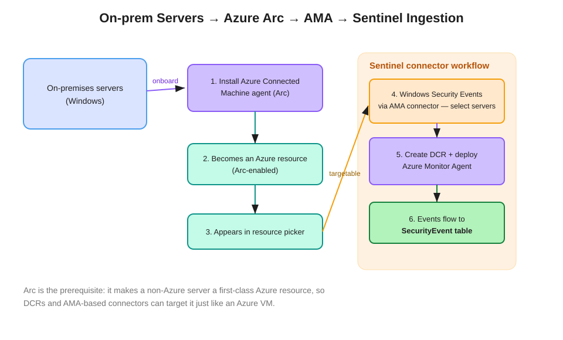

# Onboarding On-Premises Servers to Sentinel with Azure Arc and AMA

On-premises (and other-cloud) servers must be onboarded as **Azure resources via Azure Arc-enabled servers** before they can be targeted by data collection rules and the **Windows Security Events via AMA** connector in Microsoft Sentinel.

## Why Arc is required

AMA-based connectors and DCRs can only target **Azure resources**. A server running on-premises (or in another cloud) is not an Azure resource by default, so it never appears in the connector's resource selector. **Azure Arc** solves this: the **Azure Connected Machine agent** projects the machine into Azure Resource Manager as an Arc-enabled server — a first-class Azure resource you can target, tag, and govern like an Azure VM.

This is the answer to "I can't select my on-premises servers in the AMA connector — what's missing?" → the machines aren't Arc-onboarded.

## The flow

1. **Install the Azure Connected Machine agent** on each on-premises server (script, or at scale via a service principal / Configuration Manager / group policy).
2. The server **becomes an Arc-enabled Azure resource**, visible in the Azure portal under Azure Arc → Machines.
3. It now **appears in the resource picker** used by DCRs and connectors.
4. In Sentinel, open the **Windows Security Events via AMA** connector → **Create data collection rule** → **select the Arc-enabled servers** as targets.
5. The connector **creates the DCR and deploys the Azure Monitor Agent** to the selected machines (AMA replaces the legacy MMA/Log Analytics agent).
6. Collected security events flow into the **`SecurityEvent`** table in the workspace, where analytics rules and hunting can use them.

## Related facts for the exam

- **AMA vs. legacy agent**: AMA + DCR is the current model; the legacy Log Analytics agent (MMA) is retired. "Modernize Windows event collection" → AMA.
- **DCR filtering**: within the connector you choose All / Common / Minimal event sets, or a **Custom XPath** query to collect only specific event IDs — the cost-control lever. See the DCR concept for the XPath/transformation distinction.
- **Same pattern for Syslog/CEF**: Linux on-prem servers are Arc-onboarded the same way, then targeted by the Syslog/CEF via AMA connector (events land in `Syslog` / `CommonSecurityLog`).
- **Cross-tenant** collection requires Azure Lighthouse; **region** — create the DCR in the same region as the destination workspace.

## References

- [Azure Arc-enabled servers overview](https://learn.microsoft.com/en-us/azure/azure-arc/servers/overview)
- [Windows Security Events via AMA connector](https://learn.microsoft.com/en-us/azure/sentinel/connect-services-windows-based)
- [Connect Azure Arc-enabled servers to Azure Monitor](https://learn.microsoft.com/en-us/azure/azure-monitor/agents/azure-monitor-agent-manage)
- [SC-200 study guide](https://learn.microsoft.com/en-us/credentials/certifications/resources/study-guides/sc-200)
