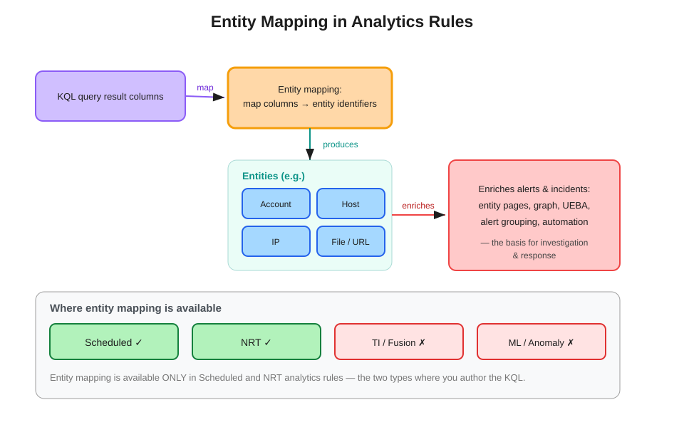

# Entity Mapping in Microsoft Sentinel Analytics Rules

Entity mapping is an integral part of configuring **scheduled** query analytics rules and can also be used in **near-real-time (NRT)** rules. It enriches a rule's output — alerts and incidents — with the essential information that becomes the building blocks of investigation and response. Entity mapping is available **only** in scheduled and NRT rules; it is not available with other analytics rule types.

## What it does

In a rule's configuration you map **columns from the KQL query output** to **entity identifiers** — for example, the `Caller` column to the Account entity's `FullName`, or `CallerIpAddress` to the IP entity's `Address`. When the rule fires, Sentinel attaches those recognized entities to the resulting alert and incident.

Common entity types: Account, Host, IP, File, FileHash, URL, Process, Mailbox, Azure resource, and more.

## Why it matters

Entities are what every downstream tool consumes:

- **Entity pages** — pivot from an alert to an entity's full context (the same pivot model as the Defender XDR IP entity page).
- **Investigation / Sentinel graph** — nodes and relationships are built from mapped entities; blast-radius analysis needs them.
- **UEBA enrichment** — behavior analytics key off entities.
- **Alert grouping** — incidents can group alerts that share the same entities within a time window.
- **Automation** — automation rule conditions and playbooks act on entities.

No entity mapping → an alert with no entities → the graph and entity pages have nothing to work with. This is why entity mapping is treated as a non-optional step, not a nice-to-have.

## Availability — and why

| Rule type | Entity mapping | Reason |
|---|---|---|
| **Scheduled** | ✓ | You author the KQL, so there are columns to map |
| **NRT** | ✓ | You author the KQL (single-table, ~1-min latency) |
| Threat intelligence | ✗ | Microsoft-defined matching logic, no user columns |
| Fusion | ✗ | Microsoft ML correlation, no user query |
| ML / Anomaly | ✗ | Microsoft-defined model output |
| Microsoft security | ✗ | Just forwards product alerts |

The pattern: entity mapping exists wherever **you write the query** (scheduled, NRT) and is absent wherever **Microsoft supplies the logic** (everything else).

## Exam tells

- "Enrich alerts with accounts/IPs/hosts for investigation" → entity mapping.
- "Which rule types support entity mapping?" → **scheduled and NRT only**.
- "Incident has no entities / graph is empty" → entity mapping was not configured on the rule.

## See also

- [Sentinel Detection Flow — concept guide](../sentinel-detection-flow/sentinel-detection-flow.md) and [hands-on lab](../sentinel-detection-flow/sentinel-detection-flow-lab.md) (the lab configures and verifies entity mapping end to end)
- [Map data fields to entities in Microsoft Sentinel](https://learn.microsoft.com/en-us/azure/sentinel/map-data-fields-to-entities)
- [SC-200 study guide](https://learn.microsoft.com/en-us/credentials/certifications/resources/study-guides/sc-200)
