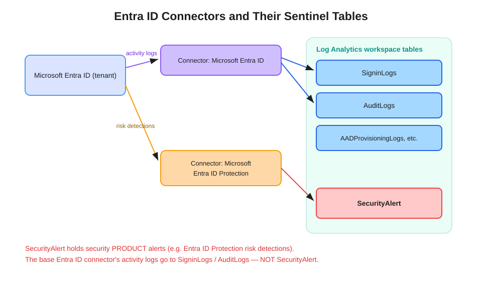

# Entra ID Connectors and Their Sentinel Tables

Which Microsoft Sentinel table does Entra ID data land in? It depends on **which connector** you add — and the common claim that the Microsoft Entra ID connector writes to `SecurityAlert` is incorrect.

## The correct mapping

| Connector | Data | Destination table(s) |
|---|---|---|
| **Microsoft Entra ID** | Sign-in activity | `SigninLogs` (+ non-interactive, service-principal, managed-identity sign-in tables) |
| **Microsoft Entra ID** | Directory audit activity | `AuditLogs` |
| **Microsoft Entra ID** | Provisioning, etc. | `AADProvisioningLogs` and other dedicated tables |
| **Microsoft Entra ID Protection** | Identity risk detections (risky sign-ins / users) | `SecurityAlert` |

## Why this matters

`SecurityAlert` is the shared table for **alerts produced by security products** — Microsoft Defender plans, Entra ID Protection, and others write their alerts there. The base **Entra ID connector ingests activity logs**, which are operational telemetry, not security alerts — so they go to their own purpose-built tables (`SigninLogs`, `AuditLogs`), never `SecurityAlert`.

If a scenario says "the Microsoft Entra ID connector stores ingested data in `SecurityAlert`," that is a distractor. The connector that feeds `SecurityAlert` with identity risk is **Microsoft Entra ID Protection**.

## Exam tells

- "Analyze sign-in failures / risky sign-in patterns / conditional access results" → `SigninLogs` (Entra ID connector).
- "Audit directory changes — role assignments, app consent, group changes" → `AuditLogs` (Entra ID connector).
- "Surface Entra **identity risk** alerts as incidents in Sentinel" → **Entra ID Protection** connector → `SecurityAlert`.
- Cross-reference: on-prem AD directory change auditing is Defender for Identity territory (`IdentityDirectoryEvents`) — see the [MDI sensitive groups report guide](../mdi-sensitive-groups-report/modifications-to-sensitive-groups-report.md).

## References

- [Connect Microsoft Entra ID to Microsoft Sentinel](https://learn.microsoft.com/en-us/azure/sentinel/connect-azure-active-directory)
- [Microsoft Entra ID Protection connector](https://learn.microsoft.com/en-us/azure/sentinel/data-connectors/microsoft-entra-id-protection)
- [SigninLogs table reference](https://learn.microsoft.com/en-us/azure/azure-monitor/reference/tables/signinlogs)
- [SC-200 study guide](https://learn.microsoft.com/en-us/credentials/certifications/resources/study-guides/sc-200)
