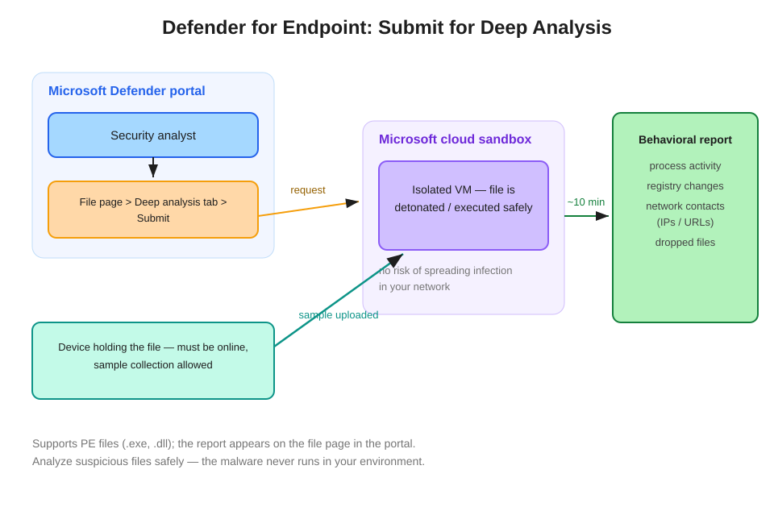

# Defender for Endpoint: Submit for Deep Analysis

Submit for deep analysis uploads a file to Microsoft's cloud sandbox for detonation and returns a detailed behavioral report — letting you analyze suspicious files safely, without the malware ever running in your environment.

## How it works

From a **file page** in the Defender portal (reached via an alert, the device timeline, or a hash search), open the **Deep analysis** tab and **Submit**. MDE pulls a **sample from a device that holds the file**, detonates it in an **isolated VM in Microsoft's cloud sandbox**, and posts a **behavioral report** back to the file page in roughly **10 minutes**:

- Process activity (what it spawned and injected)
- Registry modifications
- Network contacts — the IPs and URLs it reached out to
- Dropped files

The file executes only in Microsoft's sandbox — never in your environment.

## Prerequisites — and the classic failure mode

- A device that holds the file must be **online**.
- The **sample collection** policy on that device must allow submission.

"Submit for deep analysis is greyed out / the submission fails" → no sample is available: no online device has the file, or sample collection is disabled on the device that does. That is the troubleshooting answer.

## Scope

Deep analysis supports **PE files** (.exe, .dll). A question offering it for a PDF or an Office document is testing that limit — the email-side detonation equivalent is **Defender for Office 365 Safe Attachments**, a different product.

## Discrimination from neighbors

| Capability | What it does | Question tell |
|---|---|---|
| **Deep analysis** | Detonation + behavioral report from the portal, zero infrastructure | "Behavioral/detonation report **without** downloading the file or third-party sandboxes" |
| Live response `analyze` | In-session file metadata/verdict check | Already in a live response session |
| Live response `getfile` | Retrieve the file for **your own** tooling | "Analyze with internal forensic tools" |
| MDO Safe Attachments | Detonates email attachments pre-delivery | The file arrived via email and the question is about prevention |

## Chaining into response

The behavioral report's network contacts feed directly into containment: the IPs and URLs become **custom network indicators** with a Block action — see [Blocking Custom IPs & URLs](../mde-blocking-custom-ips-urls/blocking-custom-ips-and-urls-with-defender-for-endpoint.md).

## References

- [Take response actions on a file — deep analysis](https://learn.microsoft.com/en-us/defender-endpoint/respond-file-alerts#deep-analysis)
- [SC-200 study guide](https://learn.microsoft.com/en-us/credentials/certifications/resources/study-guides/sc-200)
