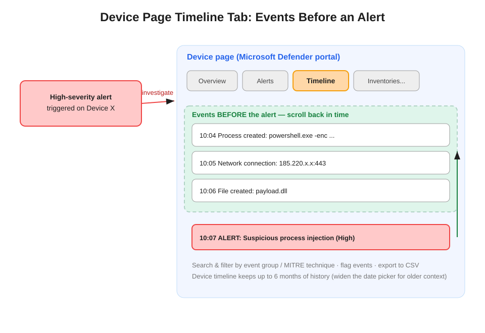

# Device Page Timeline Tab: Reviewing Events Before an Alert

You can review the events that occurred before a high-severity alert was triggered by selecting the **Timeline** tab from the **Device page** in the Microsoft Defender portal.

## What the device timeline is

The Timeline tab is a chronological stream of every raw event the Defender for Endpoint sensor recorded on **one device** — process creations, network connections, file and registry events, logons — regardless of whether any event was alert-worthy on its own. To investigate the lead-up to an alert, navigate to the alert's timestamp and scroll back: the preceding activity (an encoded PowerShell launch, an outbound connection, a dropped DLL) is right there in sequence.

Capabilities worth knowing:

- **Filter** by event group or MITRE ATT&CK technique, and **search** within the timeline.
- **Flag events** of interest — flags persist and are visible to colleagues working the same investigation.
- **Export** the timeline to CSV.
- History goes back up to **6 months**; the date picker defaults to a shorter window, so widen it for older context.

## Timeline vs. the neighboring tools

The exam tests whether you can discriminate between investigation surfaces:

| Tool | Scope | When it's the answer |
|---|---|---|
| **Device page → Timeline tab** | One device, full raw chronological history | "Review events that occurred **before** the alert **on the device**", least effort |
| Alert story / process tree | The alert's own execution chain | Understand how the alerted process itself executed |
| Advanced Hunting | Query across devices, join tables | "Across **all** devices", correlate with email/identity events |
| Incident graph | Entity relationships across the incident | Visualize scope and connections, not chronology |

The timeline and the `Device*` Advanced Hunting tables draw from the same sensor data — the timeline is essentially a pre-built, per-device chronological view of it.

## Question-pattern tell

"Review events that occurred **before** the alert" + "on the device" + "least administrative effort" → **Device page → Timeline tab**. If the question says "across all devices" or "correlate with email events," it is steering you to Advanced Hunting instead.

## References

- [Investigate devices in Defender for Endpoint](https://learn.microsoft.com/en-us/defender-endpoint/investigate-machines)
- [Device timeline event flags](https://learn.microsoft.com/en-us/defender-endpoint/device-timeline-event-flag)
- [SC-200 study guide](https://learn.microsoft.com/en-us/credentials/certifications/resources/study-guides/sc-200)
