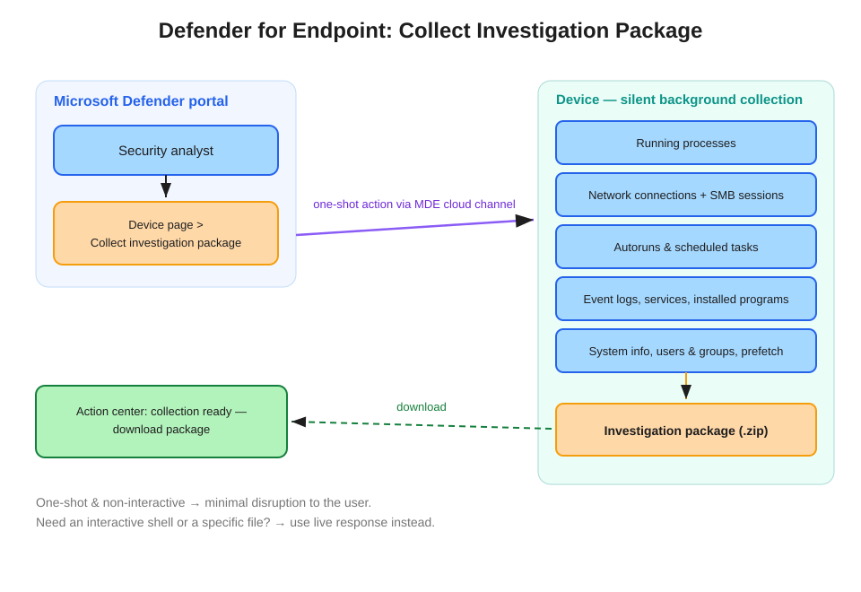

# Defender for Endpoint: Collect Investigation Package

Collect an investigation package gathers forensic evidence from a device — running process state, network connections, autoruns, event logs, and more — as a one-shot background action with minimal disruption to the user.

## How it works

From the **Device page** response actions, the analyst triggers **Collect investigation package**. The command travels over the MDE cloud channel; the sensor gathers a standardized forensic snapshot **silently in the background** — the user typically notices nothing — bundles it into a **ZIP**, and posts it to the **Action center** for download.

## What's in the package

Running processes, network connections and SMB sessions, autoruns, scheduled tasks, installed programs, event logs (including the security event log), services and drivers, users and groups, prefetch files, a temp-directory listing, and system information.

**Accuracy note**: the package captures the *state* of processes and network activity — it does **not** include a full memory dump. If a scenario genuinely requires memory acquisition, that is a live response job (forensic script) or a dedicated tool. Watch for answer options that hinge on this.

## Package vs. live response vs. AIR

| Capability | Nature | Question tell |
|---|---|---|
| **Collect investigation package** | One-shot, predefined bundle, non-interactive | "Gather forensic evidence", "minimal user disruption", "least administrative effort" |
| Live response | Interactive remote shell | "Remotely connect", "run commands", "retrieve file X" |
| Automated investigation (AIR) | Defender investigates autonomously | "Automatically investigate and remediate" |

The package and live response are complements, not competitors: package for the standard snapshot with zero interaction; live response when you need something specific or interactive. Both work on a network-isolated device, so the isolate-first-collect-second pattern is standard.

## References

- [Take response actions on a device](https://learn.microsoft.com/en-us/defender-endpoint/respond-machine-alerts)
- [Investigation package contents](https://learn.microsoft.com/en-us/defender-endpoint/respond-machine-alerts#collect-investigation-package-from-devices)
- [SC-200 study guide](https://learn.microsoft.com/en-us/credentials/certifications/resources/study-guides/sc-200)
