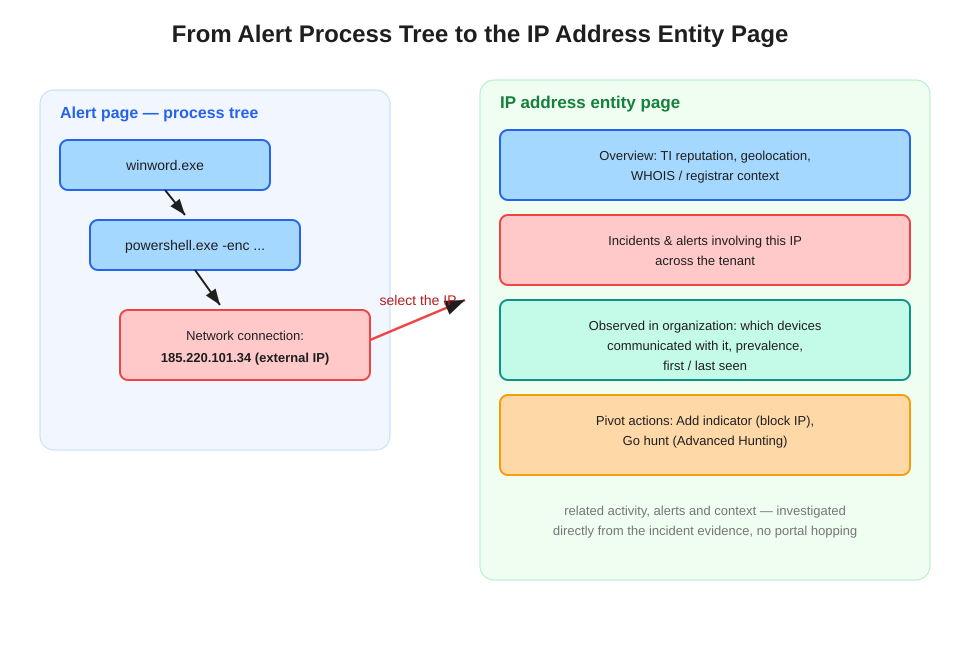

# From the Alert Process Tree to the IP Address Entity Page

Selecting an external IP address in the alert process tree opens the **IP address entity page**, enabling an investigation of the IP's related activity, alerts, and context directly from the incident evidence — without leaving the investigation.

## The entity-pivot model

Every piece of evidence in an alert — IPs, files, devices, users, URLs — is a clickable **entity**. Selecting one pivots to that entity's dedicated page in the Defender portal. For an external IP from a process tree, the entity page provides:

- **Overview** — threat intelligence reputation, geolocation, WHOIS/registrar context.
- **Incidents & alerts** — every incident and alert this IP appears in across the tenant. The scope question answered immediately: is this one affected machine, or are there five more incidents?
- **Observed in organization** — which devices communicated with the IP, prevalence, first seen / last seen. This is the blast-radius signal.
- **Pivot actions** — **Add indicator** to block the IP on the spot (see [Blocking Custom IPs & URLs](../mde-blocking-custom-ips-urls/blocking-custom-ips-and-urls-with-defender-for-endpoint.md)), and **Go hunt**, which opens Advanced Hunting with a pre-built query scoped to this IP.

Entity pages follow the same pattern for devices, users, files, and URLs/domains.

## Question-pattern tell

"Investigate the IP's **related activity, alerts, and context** directly **from the incident evidence**" → select the entity to open its **entity page**. Distractors:

- "Search the IP in Advanced Hunting" — works, but more effort; the entity page is the least-effort answer and even offers Go hunt when you do want KQL.
- "Open a threat intelligence workbook in Sentinel" — portal hopping; the context is already on the entity page.

## References

- [Investigate an IP address associated with an alert](https://learn.microsoft.com/en-us/defender-endpoint/investigate-ip)
- [Investigate alerts in Microsoft Defender XDR](https://learn.microsoft.com/en-us/defender-xdr/investigate-alerts)
- [SC-200 study guide](https://learn.microsoft.com/en-us/credentials/certifications/resources/study-guides/sc-200)
