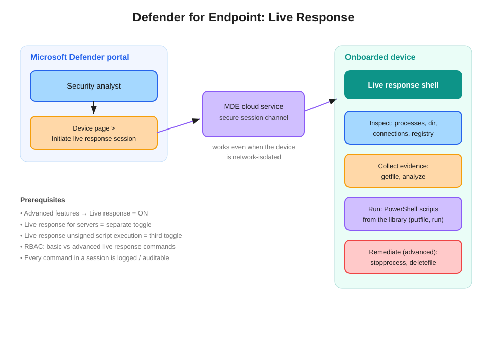

# Defender for Endpoint: Live Response

Live response allows security analysts to remotely connect to a device from the Microsoft Defender portal, inspect running processes, collect forensic evidence, and run investigation commands — through a remote shell session that works even when the device is network-isolated.

## How it works

From the **Device page** in the Defender portal, the analyst selects **Initiate live response session**, which opens a remote shell on the target device. The session rides the **MDE cloud service channel** — the sensor's own connection to the cloud — which is why live response works **even on a network-isolated device**. The standard containment-then-forensics pattern (isolate the device first, then connect with live response) is fully supported.

## Command families

| Family | Examples | Notes |
|---|---|---|
| Inspect | `processes`, `dir`, `connections`, `registry`, `scheduledtasks` | Basic commands |
| Collect evidence | `getfile`, `analyze`, `findfile` | Basic commands |
| Run scripts | `putfile` + `run` (PowerShell from the script library) | Unsigned scripts need an extra toggle |
| Remediate | `stopprocess` (`kill`), `deletefile` (`remediate`), `undo` | **Advanced** commands |

## Prerequisites and toggles

All in **Settings → Endpoints → Advanced features**:

- **Live response** — must be On.
- **Live response for servers** — a *separate* toggle. Classic trap: live response works on workstations but "fails" on a server → this toggle.
- **Live response unsigned script execution** — a third toggle, required only to run scripts that are not signed.

RBAC distinguishes **basic** from **advanced** live response permissions: an analyst with basic-only can inspect and collect but cannot `deletefile` or run remediation commands.

## Live response vs. its neighbors

| Capability | Nature | When it's the answer |
|---|---|---|
| **Live response** | Interactive remote shell | "Remotely connect", "run a script on the device", "retrieve a specific file", "inspect running processes" |
| Collect investigation package | One-shot predefined forensic bundle | "Collect standard forensic data with least effort", no interactivity needed |
| Automated investigation (AIR) | Defender investigates autonomously | "Automatically investigate and remediate alerts" |

The phrase *"remotely connect to a device, inspect running processes, collect forensic evidence, and run investigation commands"* is essentially the definitional answer text for live response.

## Audit

Every command executed in a session is logged and exportable — relevant when questions probe the compliance/audit angle of remote investigation.

## References

- [Investigate entities on devices using live response](https://learn.microsoft.com/en-us/defender-endpoint/live-response)
- [Live response command examples](https://learn.microsoft.com/en-us/defender-endpoint/live-response-command-examples)
- [SC-200 study guide](https://learn.microsoft.com/en-us/credentials/certifications/resources/study-guides/sc-200)
