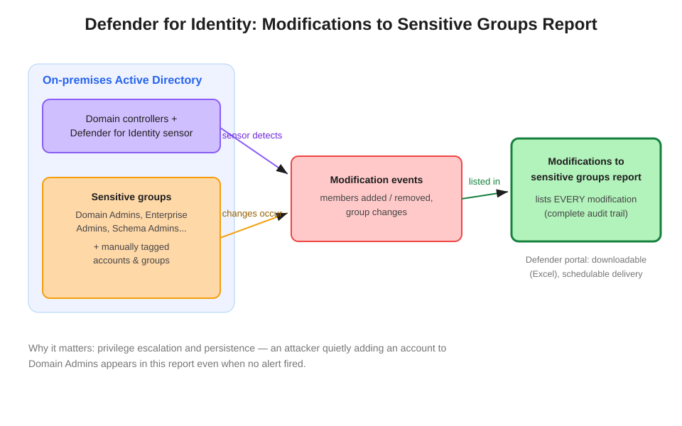

# Defender for Identity: Modifications to Sensitive Groups Report

The Microsoft Defender for Identity **Modifications to sensitive groups** report lists every modification made to sensitive groups — built-in privileged AD groups plus any accounts or groups you have manually tagged as sensitive.



## How it works

The **Defender for Identity sensor** runs directly on domain controllers, monitoring Active Directory activity in real time. Among the tracked activity: any membership or property change to **sensitive groups**:

- **Automatically tagged**: built-in privileged groups such as Domain Admins, Enterprise Admins, Schema Admins, Administrators, Account Operators, Backup Operators, and others.
- **Manually tagged**: any additional accounts or groups you designate as sensitive in the Defender portal (Settings → Identities → Entity tags) — break-glass accounts, critical service accounts, custom admin groups.

Every add, remove, or change event is recorded, and the report lists **all of them** over the report period — not just changes that triggered an alert.

## Report vs. alert — the key distinction

| Need | Use |
|---|---|
| "Identify **all** changes to Domain Admins last month, least admin effort" | This report — complete retrospective audit trail |
| "Be **notified in real time** when a sensitive group changes" | MDI detections, or a custom detection on `IdentityDirectoryEvents` |

Alerts fire on *suspicious* patterns; the report is *comprehensive*. An attacker who quietly adds a backdoor account to Domain Admins during a legitimate-looking change window might not trip an alert — the report still shows it. The verb in the question (identify/list vs. notify/alert) tells you which one is being asked for.

## Accessing the report

The report is available in the Microsoft Defender portal's identity reporting area, is **downloadable as Excel**, and can be **scheduled** for periodic delivery (e.g., monthly to the identity governance team).

## Real-time companion: Advanced Hunting

For the alerting side of the same need, group membership changes land in the `IdentityDirectoryEvents` table:

```kql
IdentityDirectoryEvents
| where ActionType == "Group Membership changed"
| extend GroupName = tostring(parse_json(AdditionalFields).["TO.GROUP"])
| where GroupName has "Domain Admins"
| project Timestamp, TargetAccountDisplayName, GroupName, AccountName
```

Wrap that in a custom detection rule for near-real-time notification.

## Why sensitive tagging matters beyond this report

The sensitive designation drives more than reporting: sensitive accounts receive additional MDI detection logic, including lateral movement path analysis. Tagging break-glass and critical service accounts is a standard identity hardening step.

## References

- [Defender for Identity entity tags (sensitive accounts and groups)](https://learn.microsoft.com/en-us/defender-for-identity/entity-tags)
- [Defender for Identity reports](https://learn.microsoft.com/en-us/defender-for-identity/reports)
- [IdentityDirectoryEvents table reference](https://learn.microsoft.com/en-us/defender-xdr/advanced-hunting-identitydirectoryevents-table)
- [SC-200 study guide](https://learn.microsoft.com/en-us/credentials/certifications/resources/study-guides/sc-200)
