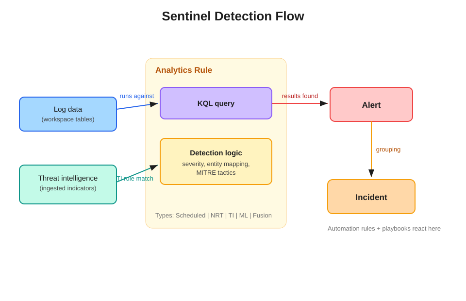

# Sentinel Detection Flow

## How it works, left to right

The **analytics rule** is the container. Inside it live two pieces:

- **KQL query** — *what* to look for.
- **Detection logic** — *what the result means*: severity, which columns map to entities, and the MITRE tactics/techniques.

The rule runs its query against your **workspace log tables** on a schedule. **Threat intelligence** is a special case: instead of custom KQL you wrote, the rule's "query" effectively matches incoming logs against your ingested indicators.

## From query to incident

1. **Query returns results** → the rule emits an **alert** — one alert per result set, or one per row, depending on event-grouping settings.
2. **Alerts group into an incident** based on the rule's incident settings (e.g., group alerts sharing the same entities within a time window).
3. The **incident** is the unit analysts actually triage.

## Where the analytics rule stops

Everything to the right of the incident — assignment, tagging, playbooks — belongs to **automation rules**, not to the analytics rule itself.
