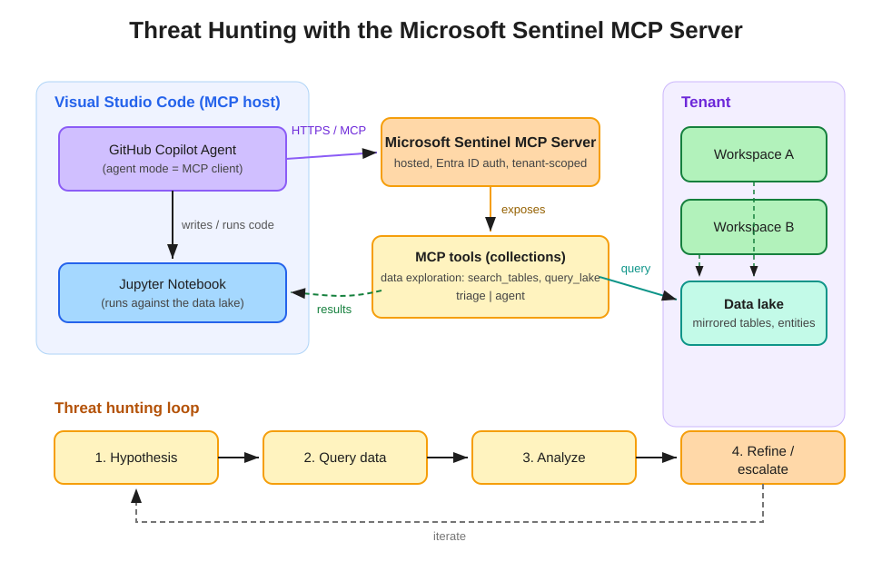

# Hunt for Threats Using the Microsoft Sentinel MCP Server

AI-assisted threat hunting over the Microsoft Sentinel data lake using Visual Studio Code, GitHub Copilot in agent mode, and the hosted Microsoft Sentinel MCP server.



## Overview

The Model Context Protocol (MCP) is an open standard that lets AI agents discover and call external tools in a structured, stateful way. Microsoft Sentinel exposes a **fully hosted MCP server** — no infrastructure to deploy, authenticated with **Microsoft Entra ID** — that gives compatible clients natural-language access to security data in the Sentinel data lake.

In this workflow:

1. **Visual Studio Code** acts as the MCP *host*. Adding the Sentinel MCP endpoint instantiates an MCP *client* that maintains the connection to the server.
2. **GitHub Copilot in agent mode** issues natural-language intents, discovers the available MCP tools, and calls them on your behalf.
3. The **Sentinel MCP server** executes the tool calls against the **data lake**, which holds mirrored log tables and entity data from the workspaces in your **tenant**, scoped to your permissions.
4. **Results** flow back to the agent, which can reason over them, write KQL or Python into a **Jupyter notebook**, and iterate through the hunting loop: hypothesis → query → analyze → refine or escalate.

## Tool collections

Sentinel MCP capabilities ship as scenario-focused collections, each exposed as its own MCP server endpoint:

| Collection | Endpoint | Purpose |
|---|---|---|
| Data exploration | `https://sentinel.microsoft.com/mcp/data-exploration` | Search for relevant tables and run natural-language-driven queries over the data lake (e.g., `search_tables`, `query_lake`) |
| Triage | `https://sentinel.microsoft.com/mcp/triage` | Incident triage and investigation assistance |
| Agent | (see docs) | Build and manage Security Copilot agents |

For threat hunting, **data exploration** is the primary collection.

## Prerequisites

- A Microsoft Sentinel workspace onboarded to the **Microsoft Sentinel data lake**
- Microsoft Entra ID permissions to read the data lake tables you intend to hunt over (queries run under *your* identity and permissions)
- **Visual Studio Code** with the **GitHub Copilot** extension and an active Copilot subscription with agent mode enabled
- Optional: the Microsoft Sentinel extension for VS Code for notebook-based hunting against the data lake

## Setup: connect VS Code to the Sentinel MCP server

1. In VS Code, open the Command Palette (`Ctrl+Shift+P`) → **MCP: Add Server** → choose **HTTP (HTTP or Server-Sent Events)**.
2. Enter the endpoint for the collection you want, e.g. `https://sentinel.microsoft.com/mcp/data-exploration`, and give it a name.
3. Alternatively, declare the servers in your `mcp.json`:

   ```json
   {
     "servers": {
       "sentinel-data-exploration": {
         "type": "http",
         "url": "https://sentinel.microsoft.com/mcp/data-exploration"
       },
       "sentinel-triage": {
         "type": "http",
         "url": "https://sentinel.microsoft.com/mcp/triage"
       }
     }
   }
   ```

4. Select **Start** above the server entry. Sign in when prompted (Entra ID). The status changes to **Running** when active.
5. Open **Copilot Chat → Agent mode** and ask the agent to list the available MCP tools to validate the connection.

## Hunting workflow

A typical hunt follows the classic loop, with the agent removing the need to memorize table schemas:

1. **Hypothesis** — e.g., "an identity-based attack is abusing OAuth consent in the last 30 days."
2. **Query** — prompt the agent in natural language; it uses `search_tables` to find candidate tables and `query_lake` to retrieve data across workspaces in the tenant.
3. **Analyze** — review the structured results; ask the agent to correlate entities, summarize anomalies, or generate visualizations in a notebook.
4. **Refine or escalate** — narrow the hypothesis and iterate, or escalate confirmed findings into an incident and capture the final queries as hunting queries / custom detections.

### Example prompts

- "Search the data lake for tables containing sign-in activity, then show failed sign-ins followed by a success for the same account in the last 7 days, grouped by account and source IP."
- "Which third-party data sources ingested data in the last 7 days, and do the volumes look healthy?"
- "For the entities in incident X, map the relationships between users, hosts, IPs, and file hashes."

## Security considerations

- Tool calls run with **your** credentials and permissions — least privilege applies.
- Responses are processed by the model in your MCP client; review your organization's policy on sending security data to AI assistants.
- Treat agent-generated KQL like any other code: review before operationalizing it as an analytics rule or custom detection.

## References

- [What is Microsoft Sentinel's support for MCP?](https://learn.microsoft.com/en-us/azure/sentinel/datalake/sentinel-mcp-overview)
- [Microsoft Sentinel data lake documentation](https://learn.microsoft.com/en-us/azure/sentinel/datalake/)
- [Microsoft Sentinel Training Lab — MCP exercise](https://github.com/Azure/Azure-Sentinel/blob/master/Tools/Microsoft-Sentinel-Training-Lab/Exercises/E14_MCP.md)
- [SC-200 study guide](https://learn.microsoft.com/en-us/credentials/certifications/resources/study-guides/sc-200)
