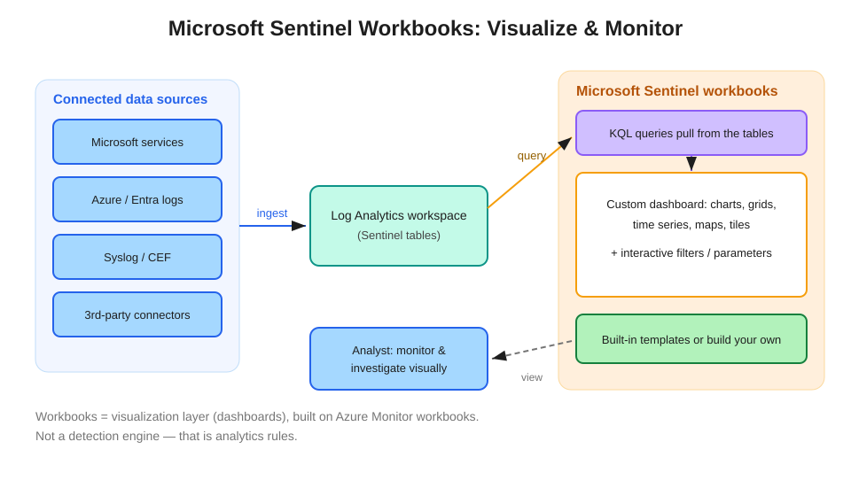

# Microsoft Sentinel Workbooks: Visualize and Monitor Your Data

Once data sources are connected to Microsoft Sentinel, **workbooks** let you visualize and monitor that data through custom, interactive dashboards.

## How it fits together

1. **Connect data sources** — Microsoft services, Azure/Entra logs, Syslog/CEF, third-party connectors — which ingest into the **Log Analytics workspace** that backs Sentinel.
2. **Workbooks sit on top as the visualization layer.** Each workbook runs **KQL queries** against the workspace tables and renders the results as visual elements.
3. **Build custom dashboards** from charts, grids, time charts, maps, and tiles, with **interactive filters and parameters** (time range, subscription, severity) that let viewers slice the data without editing queries.
4. Start from **built-in templates** (Sentinel ships many, often paired with the data connector for a source) or **build your own** from a blank workbook.

## Key facts for the exam

- **Workbooks visualize; they do not detect.** They display and monitor data — they do not generate alerts. "Visualize / monitor / dashboard" → workbooks; "detect / alert" → analytics rules. This is the most common discrimination point.
- **Built on Azure Monitor workbooks** — the same engine, so they can visualize data beyond Sentinel and reuse Azure Monitor workbook skills.
- **Template vs. saved instance** — a template is read-only; customizing it saves a separate, editable copy. Saved workbooks can be shared and access-controlled via Azure RBAC on the workbook resource.
- **Versatility** — the word in the exam phrasing ("versatility in creating custom dashboards") maps specifically to workbooks, as distinct from hunting (investigation queries) and notebooks (advanced/programmatic analysis).

## Workbooks vs. neighboring features

| Feature | Purpose |
|---|---|
| **Workbooks** | Custom, interactive visualization and monitoring dashboards |
| Analytics rules | Detection — generate alerts and incidents |
| Hunting queries | Proactive, hypothesis-driven investigation (not dashboards) |
| Notebooks | Advanced analysis, ML, and automation over data (Python/KQL) |
| SOC optimization / overview pages | Prebuilt, non-customizable summary views |

## References

- [Visualize collected data with workbooks](https://learn.microsoft.com/en-us/azure/sentinel/monitor-your-data)
- [Commonly used Microsoft Sentinel workbooks](https://learn.microsoft.com/en-us/azure/sentinel/top-workbooks)
- [SC-200 study guide](https://learn.microsoft.com/en-us/credentials/certifications/resources/study-guides/sc-200)
