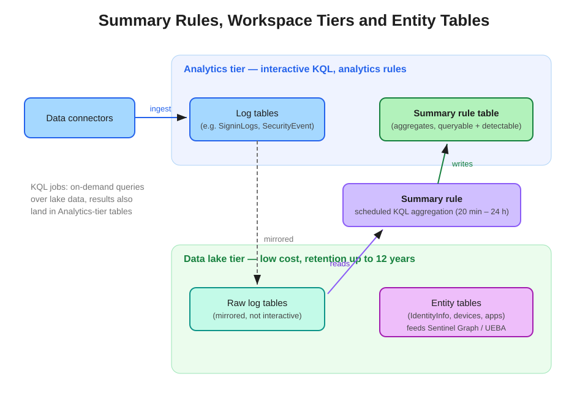

# Summary Rules, Workspace Tiers and Entity Tables

How the Microsoft Sentinel platform balances cost and queryability: the Analytics and Data lake tiers, summary rules for scheduled aggregation, KQL jobs for retrospective hunts, and the entity tables that power Sentinel Graph and UEBA.

## Workspace tiers

Data ingested into a Microsoft Sentinel workspace lands in the **Analytics tier** — the fully interactive layer where analysts run KQL directly and where analytics rules execute. The same data is **mirrored into the Data lake tier** at no additional ingestion cost, where it can be retained for up to 12 years at a fraction of the price.

Key properties:

| | Analytics tier | Data lake tier |
|---|---|---|
| Query model | Interactive KQL | Not directly interactive — accessed via KQL jobs, summary rules, notebooks |
| Detections | Analytics rules run here | Analytics rules **cannot** see lake data |
| Cost | Premium ingestion + retention | Low-cost, long retention (up to 12 years) |
| Typical use | Hot investigation data, detections | Compliance retention, retrospective hunting, high-volume/low-value sources |

Low-value, high-volume tables (verbose firewall logs, NetFlow, etc.) can be sent **lake-only**, skipping the Analytics tier entirely — the main cost lever surfaced by SOC optimization's data-value recommendations.

## Summary rules

A **summary rule** is a scheduled KQL aggregation (bins from 20 minutes up to 24 hours) that reads data — including lake-tier data — and writes the results into a **summary table that lives in the Analytics tier**.

The pattern this enables: keep raw, verbose events cheaply in the lake while the aggregates you actually query repeatedly (sign-in failures per hour per app, bytes per destination, alert counts per source) stay interactively queryable. Because the summary table is an ordinary Analytics-tier table, **scheduled analytics rules can run detections against it** — aggregate cheap, detect on the summary.

## KQL jobs vs. summary rules

Both reach into the lake and land results in the Analytics tier, but they answer different needs:

| | KQL job | Summary rule |
|---|---|---|
| Trigger | On-demand (asynchronous) | Recurring schedule |
| Direction | Retrospective — re-run a hunt over months of aged data | Forward-looking — continuous aggregation |
| Typical scenario | "Re-investigate 6 months of lake data after a new IOC drops" | "We repeatedly need hourly aggregates from a high-volume source" |
| Output | Results written to an Analytics-tier table for interactive investigation | Summary table in the Analytics tier |

## Entity tables

The lake holds more than logs: **entity tables** such as `IdentityInfo` (users from Microsoft Entra ID), devices, and applications live alongside the log data. These entities are what give **Sentinel Graph** its nodes — when you build a hunting graph and expand the blast radius from a compromised account, the graph traverses relationships between these entities and the surrounding log activity. UEBA enrichment draws on the same entity data.

Practical implication for detection engineering: entity mapping in analytics rules and clean entity data in the lake are what make graph-based hunting and blast-radius analysis possible. No entities, no graph.

## References

- [Microsoft Sentinel data lake documentation](https://learn.microsoft.com/en-us/azure/sentinel/datalake/)
- [Summary rules in Microsoft Sentinel](https://learn.microsoft.com/en-us/azure/sentinel/summary-rules)
- [KQL jobs in the Microsoft Sentinel data lake](https://learn.microsoft.com/en-us/azure/sentinel/datalake/kql-jobs)
- [SC-200 study guide](https://learn.microsoft.com/en-us/credentials/certifications/resources/study-guides/sc-200)
